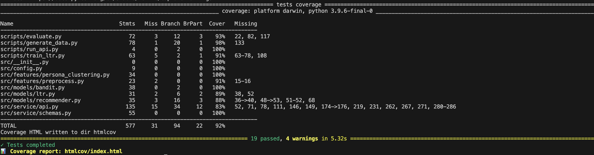
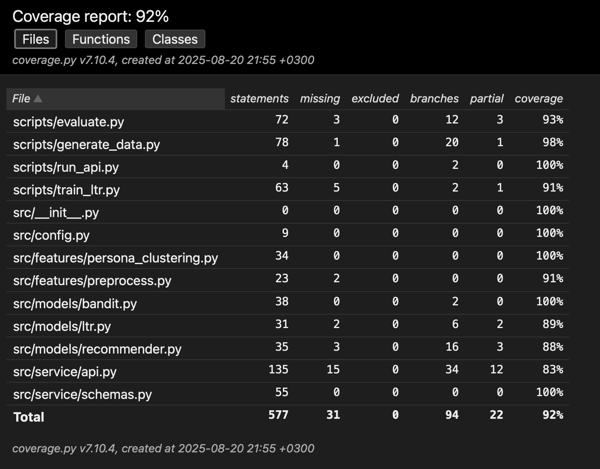
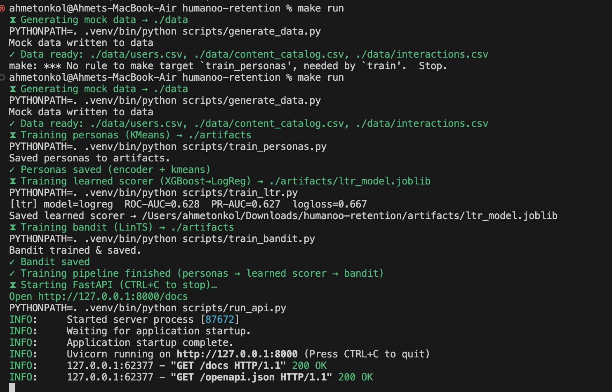
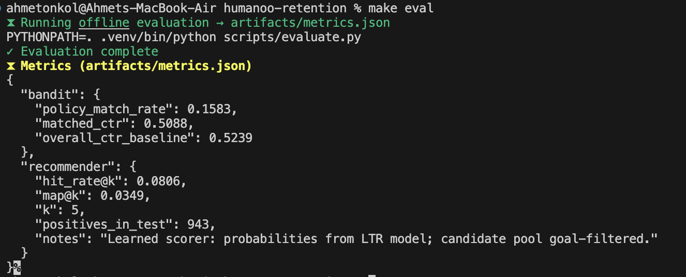

# Humanoo Case Study – Applied AI Engineer

## Overview
This repository contains my submission for the Humanoo Applied AI Engineer case study.  
The objective was to address **early user drop-off within the first two weeks** by designing and implementing an AI/ML-powered prototype that demonstrates how personalization can improve engagement.

This project includes:
- **Code** (Python scripts with a Makefile workflow)
- **README.md** (setup, run, testing, coverage, guidelines, endpoints)
- **docs/** (screenshots and PDF summary)
- **PDF summary** covering problem exploration, solution proposal, prototype implementation, and trade-offs

---

## Quick Start Order

1. `make setup`
2. `make test` (to confirm environment and generate coverage)
3. `make run`
4. Open new terminal → `make eval`

---

## Makefile Commands and Examples

**`make setup` (create environment):**  


**`make test` (unit tests with coverage):**  
  


**`make run` (start API service):**  


**`make eval` (offline evaluation):**  


**Optional:**  
- `make lint` – lint codebase  
- `make format` – auto-format sources  
- `make clean` – remove build artifacts  

---

## API Endpoints

### 1. Helper Endpoint
```bash
curl -X 'GET'   'http://127.0.0.1:8000/helper'   -H 'accept: application/json'
```
  


---

### 2. Recommendations Endpoint
```bash
curl -X 'POST'   'http://127.0.0.1:8000/recommendations'   -H 'accept: application/json'   -H 'Content-Type: application/json'   -d '{
  "context": {
    "day_of_week": 6,
    "hour_bucket": "morning"
  },
  "top_k": 5,
  "user": {
    "age": 29,
    "baseline_activity_min_per_day": 12,
    "chronotype": "morning",
    "gender": "female",
    "language": "en",
    "premium": true,
    "primary_goal": "weight_loss",
    "push_opt_in": true,
    "user_id": "u0001",
    "work_pattern": "9-5"
  }
}'
```
  


---

### 3. Feedback Endpoint
```bash
curl -X 'POST'   'http://127.0.0.1:8000/feedback'   -H 'accept: application/json'   -H 'Content-Type: application/json'   -d '{
  "arm": "push_morning",
  "content_id": "c0002",
  "day_of_week": 6,
  "hour_bucket": "morning",
  "reward": 1,
  "user_id": "u0001"
}'
```
  


---

### 4. Metrics Endpoint
```bash
curl -X 'GET'   'http://127.0.0.1:8000/metrics'   -H 'accept: application/json'
```
  


---

## Trade-offs & Risks
- Cold start – mitigated with onboarding defaults and popularity priors  
- Explainability – SHAP values needed for interpretation  
- Fairness/diversity – prevent skew toward one content type  
- Latency – addressed with caching and feature pre-compute  
- Scalability – production would need distributed pipelines  

---

## Next Steps
With more time I would:  
- Add embeddings for users/items to improve retrieval  
- Build an A/B testing harness for online evaluation  
- Integrate contextual bandits for adaptive personalization  
- Expand simulated data to reflect complex user journeys  

---

## Deliverables
- **README.md** – this file  
- **docs/Humanoo_Case_Study_Summary.pdf** – structured reflection  
- **docs/** – screenshots (setup, run, eval, endpoints, coverage)  
- **Codebase** – Python scripts with recommender prototype  

---
